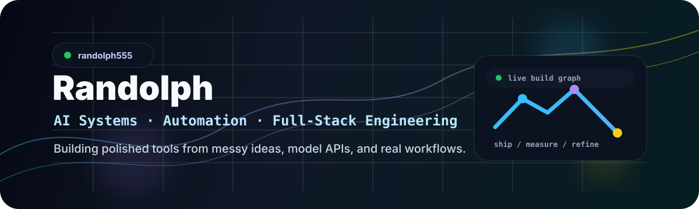
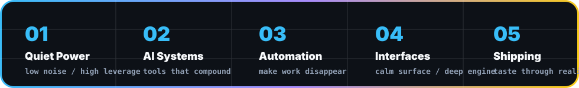
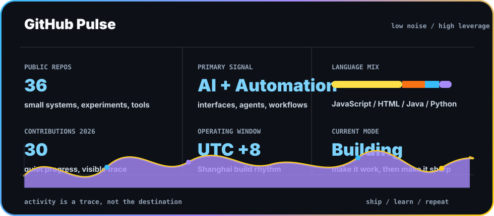

<div align="center">
  
</div>

<br />

<div align="center">
  <a href="https://github.com/randolph555?tab=followers">
    
  </a>
  <a href="https://github.com/randolph555">
    
  </a>
  
</div>

<br />

<div align="center">
  
</div>

<br />

<div align="center">
  
</div>

## Signal

Quietly building. Carefully observing. Slowly becoming dangerous.

I like systems that look simple, hide complexity, and make people wonder how much is happening under the surface.

```ts
const randolph555 = {
  base: "Shanghai",
  signal: "low noise, high leverage",
  interests: ["AI", "automation", "interfaces", "systems"],
  stack: ["TypeScript", "Python", "Rust", "Go", "React", "Cloudflare", "Docker"],
  rule: "make it work, make it sharp, make it disappear",
};
```

## Toolbox

<div align="center">
  
</div>

## Highlights

<div align="center">
  
</div>

## Featured Builds

<table>
  <tr>
    <td width="50%">
      <h3 align="center">sse-client</h3>
      <p align="center">A focused client for streaming workflows and realtime integrations.</p>
      <p align="center">
        <a href="https://github.com/randolph555/sse-client">
          
        </a>
      </p>
    </td>
    <td width="50%">
      <h3 align="center">cloud-frame</h3>
      <p align="center">Cloud-oriented application structure for fast iteration and deployment.</p>
      <p align="center">
        <a href="https://github.com/randolph555/cloud-frame">
          
        </a>
      </p>
    </td>
  </tr>
</table>

## Notes To Self

<table>
  <tr>
    <td width="50%">
      <h3 align="center">01</h3>
      <p align="center"><strong>Code is not magic.</strong><br />It is compressed decision-making.</p>
    </td>
    <td width="50%">
      <h3 align="center">02</h3>
      <p align="center"><strong>The interface is the product.</strong><br />Everything else is negotiation with reality.</p>
    </td>
  </tr>
  <tr>
    <td width="50%">
      <h3 align="center">03</h3>
      <p align="center"><strong>Good tools feel inevitable.</strong><br />Bad tools explain themselves.</p>
    </td>
    <td width="50%">
      <h3 align="center">04</h3>
      <p align="center"><strong>Move quietly.</strong><br />Let the system speak when it works.</p>
    </td>
  </tr>
</table>

## Operating Principles

<table>
  <tr>
    <td><strong>Latency is honesty.</strong></td>
    <td>If something feels slow, the architecture is already talking.</td>
  </tr>
  <tr>
    <td><strong>Abstraction has a cost.</strong></td>
    <td>Pay it only when the complexity is real.</td>
  </tr>
  <tr>
    <td><strong>Elegance is deletion.</strong></td>
    <td>The best feature is often the one that made five others unnecessary.</td>
  </tr>
  <tr>
    <td><strong>Shipping changes taste.</strong></td>
    <td>Ideas are cheap until they survive real use.</td>
  </tr>
</table>

## GitHub Pulse

<div align="center">
  
</div>

## 3D Contribution Scene

<div align="center">
  <picture>
    <source media="(prefers-color-scheme: dark)" srcset="https://raw.githubusercontent.com/randolph555/randolph555/main/profile-3d-contrib/profile-night-rainbow.svg" />
    <source media="(prefers-color-scheme: light)" srcset="https://raw.githubusercontent.com/randolph555/randolph555/main/profile-3d-contrib/profile-gitblock.svg" />
    
  </picture>
</div>

## Contribution Flow

<div align="center">
  <picture>
    <source media="(prefers-color-scheme: dark)" srcset="https://raw.githubusercontent.com/randolph555/randolph555/output/github-contribution-grid-snake-dark.svg" />
    <source media="(prefers-color-scheme: light)" srcset="https://raw.githubusercontent.com/randolph555/randolph555/output/github-contribution-grid-snake.svg" />
    
  </picture>
</div>

## Current Direction

<table>
  <tr>
    <td><strong>AI tooling</strong></td>
    <td>Building model-powered interfaces that turn rough prompts into repeatable workflows.</td>
  </tr>
  <tr>
    <td><strong>Automation</strong></td>
    <td>Reducing repetitive browser, data, and operations work with practical agents.</td>
  </tr>
  <tr>
    <td><strong>Product polish</strong></td>
    <td>Designing the last 20 percent so tools feel fast, clean, and dependable.</td>
  </tr>
</table>

<br />

<div align="center">
  
</div>
